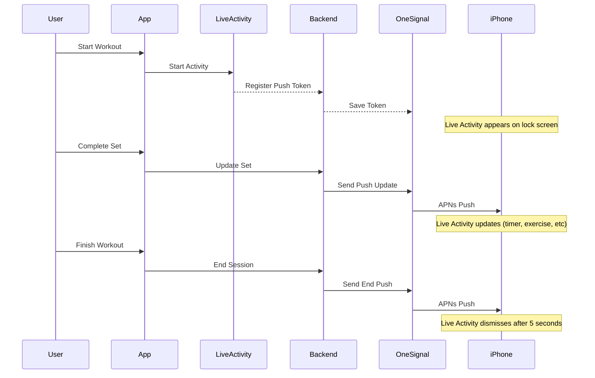

# Live Activities for HealthPilot Workouts 🏋️

## What Are Live Activities?

Live Activities display real-time workout information on your iPhone lock screen. During a workout, you can:

- ✅ See current exercise and set progress
- ✅ Watch rest timer count down in real-time
- ✅ View next exercise preview
- ✅ See elapsed time and heart rate
- ✅ Tap buttons to complete sets, skip exercises, or end workout
- ✅ All without unlocking your phone!

Perfect for when your hands are sweaty or you're mid-set and don't want to unlock your device.

## What's Been Built

### ✅ Backend (100% Complete)
- API endpoints for Live Activity management (`/api/live-activities/*`)
- OneSignal integration for APNs push notifications
- Real-time updates sent every 15 seconds during rest periods
- Automatic cleanup when workout ends

### ✅ Frontend (100% Complete)
- TypeScript wrapper for Live Activity plugin
- Integration with `WorkoutSession.tsx`
- Automatic start when workout begins
- Automatic updates when sets are completed
- Automatic end when workout finishes

### 📱 iOS Native Code (Ready for You to Add)
All Swift/SwiftUI code is written and ready to copy/paste into Xcode:
- `WorkoutLiveActivity.swift` - Main Live Activity widget
- `WorkoutWidgetBundle.swift` - Widget bundle configuration
- `LiveActivityPlugin.swift` - Capacitor plugin bridge

## What You Need to Do

### Time Required: 2-4 hours

1. **Xcode Setup (1-2 hours)**
   - Add Widget Extension target
   - Configure App Groups
   - Copy Swift code files
   - Enable Push Notifications capability

2. **OneSignal Configuration (30-60 minutes)**
   - Get APNs Authentication Key from Apple Developer Portal
   - Configure OneSignal Dashboard
   - Add credentials to Replit Secrets

3. **Testing (30-60 minutes)**
   - Build and run on physical iPhone (iOS 16.1+)
   - Test workout flow with Live Activity
   - Verify lock screen interactions work

## Implementation Guides

Start here:

1. **[OneSignal Setup](./ONESIGNAL_SETUP.md)** - Configure APNs credentials (do this first!)
2. **[Xcode Setup Guide](./SETUP_GUIDE.md)** - Step-by-step Xcode instructions with all Swift code

## Files Provided

```
docs/live-activities/
├── README.md                    # This file
├── SETUP_GUIDE.md               # Complete Xcode setup instructions
├── ONESIGNAL_SETUP.md           # OneSignal/APNs configuration
├── WorkoutLiveActivity.swift    # Live Activity widget code
├── WorkoutWidgetBundle.swift    # Widget bundle code
└── LiveActivityPlugin.swift     # Capacitor plugin bridge code
```

## Backend Code (Already Implemented)

- `server/routes.ts` - API endpoints added
- `server/services/liveActivities.ts` - OneSignal push service
- `client/src/lib/liveActivity.ts` - TypeScript wrapper
- `client/src/pages/WorkoutSession.tsx` - Integration code

No backend work needed - it's all ready to go!

## How It Works



## Features

### Current Exercise Display
- Shows exercise name (e.g., "BENCH PRESS")
- Shows set progress (e.g., "Set 2 of 4")
- Next exercise preview

### Live Rest Timer
- Counts down from 90 seconds (or custom duration)
- Updates in real-time on lock screen
- Visual progress bar
- Push updates every 15 seconds

### Stats Display
- Heart rate and zone (when available from HealthKit)
- Elapsed workout time
- Real-time updates

### Interactive Buttons
- **Pause/Resume** - Pause the workout timer
- **Complete Set** - Mark current set complete
- **Skip Exercise** - Move to next exercise

### Glassmorphic Design
- Beautiful gradient background
- Semi-transparent blur effects
- Matches your provided widget design
- Clean, modern iOS aesthetic

## Requirements

- **iOS Version**: 16.1 or later
- **Device**: Physical iPhone (Simulators don't support Live Activities)
- **Xcode**: 14.1 or later
- **Apple Developer Account**: Free or paid tier
- **OneSignal Account**: Free tier works

## Testing Checklist

After setup, verify:

- [ ] Live Activity appears when workout starts
- [ ] Timer counts down on lock screen
- [ ] Completing a set updates the display
- [ ] Buttons work from lock screen
- [ ] Activity dismisses when workout ends
- [ ] Works after locking iPhone
- [ ] Works after pressing power button mid-workout

## Troubleshooting

See the [Setup Guide](./SETUP_GUIDE.md#troubleshooting) for common issues and solutions.

## Future Enhancements

Ideas for v2:
- Dynamic Island support (already in code!)
- Heart rate monitoring via HealthKit
- Custom rest timer adjustments (+15s, -15s buttons)
- Workout-specific backgrounds
- Achievement notifications
- Rest period reminders

## Support

If you encounter issues:
1. Check [Troubleshooting](./SETUP_GUIDE.md#troubleshooting) section
2. Verify OneSignal credentials in [OneSignal Setup](./ONESIGNAL_SETUP.md)
3. Check Xcode console for error messages
4. Ensure you're on physical device, not Simulator

---

**Ready to get started?** Begin with [OneSignal Setup](./ONESIGNAL_SETUP.md)!
